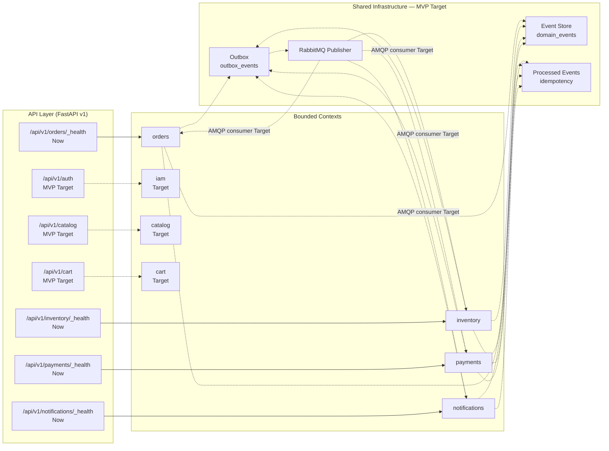
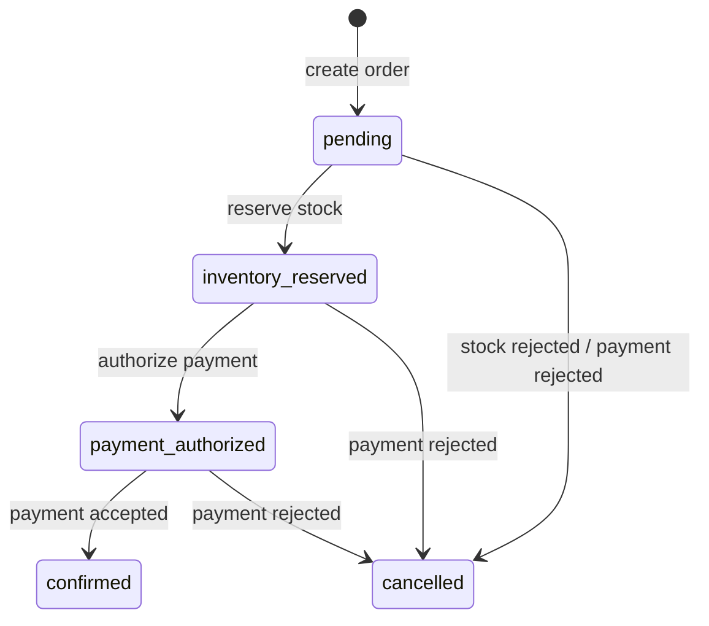

# Architecture

> **Canonical architecture notice**
> This document describes `eventcommerce` as it exists in the working tree today, plus the planned MVP target. Claims are tagged **Now** (committed and wired), **MVP Target** (next vertical slices), or **Future** (not committed). If a capability is partial — code exists but is not scheduled or connected — it is labeled **Partial** and never described as live.
>
> Product intent lives in [PRD.md](./PRD.md). Domain and event vocabulary is owned by [docs/GLOSSARY.md](./docs/GLOSSARY.md). Target UX lives in [DESIGN.md](./DESIGN.md). Significant decisions are recorded in the [ADR index](./docs/adr/README.md).

## Overview

EventCommerce is a **modular monolith**: one deployable Python backend composed of bounded contexts that each own their domain model, application services, infrastructure, and API surface. The boundaries are directory-based today; contexts are independent scaffolds and do not yet communicate through a shared event envelope or transactional outbox. MVP Target introduces choreography backed by the outbox and idempotent consumers.

| Horizon | State |
|---|---|
| **Now** | Four bounded contexts exist in `backend/app/modules/`: `orders`, `inventory`, `payments`, `notifications`. Each exposes only `GET /_health`. No shared event store, outbox, idempotency, RabbitMQ publisher, or `dependency-injector` containers exist in the published tree. |
| **MVP Target** | Add `iam`, `catalog`, `cart`, and a `checkout` orchestrator; introduce a shared event envelope, event store, transactional outbox, idempotency store, and RabbitMQ publisher/consumer; bootstrap the AMQP consumer and outbox worker; replace the random payment stub with a deterministic simulated provider. |
| **Future** | Real payment provider, saga orchestration, dead-letter handling, observability stack, frontend. |

## Topology



Solid arrows are **Now**; dashed arrows are **MVP Target**. No shared infrastructure exists yet; the dashed paths show what the MVP Target will wire.

## Bounded contexts

### Current contexts (`backend/app/modules/`)

| Context | Responsibility | API state |
|---|---|---|
| `orders` | Order aggregate lifecycle and state machine (`pending`, `inventory_reserved`, `payment_authorized`, `confirmed`, `cancelled`). | **Partial** — only `GET /api/v1/orders/_health` exposed. |
| `inventory` | Stock reservation and release. | **Partial** — use cases exist; only `GET /_health` exposed. |
| `payments` | Authorization and failure handling. | **Partial** — use cases exist; only `GET /_health` exposed. |
| `notifications` | Reactions to order events. | **Partial** — use cases exist; only `GET /_health` exposed. |

### Target contexts (MVP)

| Context | Responsibility |
|---|---|
| `iam` | JWT registration, login, and role authorization as an owned bounded context. |
| `catalog` | Product browsing and catalog management. |
| `cart` | Purchase collection before checkout. |
| `checkout` | Orchestrates cart, inventory, and payment in one request. |

Event names, producers, and consumers are governed by [docs/GLOSSARY.md](./docs/GLOSSARY.md). This document does not duplicate that table.

## Patterns

### Layer and boundary rules

Each context follows the same layering:

```text
domain/        — entities, value objects, domain services, domain errors
application/   — use cases, transaction/coordination logic, no framework imports
infrastructure/— SQLAlchemy models/repositories, messaging adapters
api/           — FastAPI routes, schemas, dependency-injector container (MVP Target)
```

Rules:

- `domain/` has no dependencies on `application/`, `infrastructure/`, or `api/`.
- `application/` depends only on `domain/` and shared ports/protocols.
- `infrastructure/` implements `domain/` repository protocols and shared messaging abstractions.
- `api/` wires framework dependencies and delegates to `application/` use cases.

### Event-driven integration

| Pattern | State | Notes |
|---|---|---|
| **Shared event store** | **MVP Target** | Planned path `backend/app/shared/events/`; no code in published tree. |
| **Shared event envelope** | **MVP Target** | Planned path `backend/app/shared/messaging/envelope.py`; no code in published tree. |
| **Transactional outbox** | **MVP Target** | Planned path `backend/app/shared/messaging/outbox_repository.py`; no code in published tree. |
| **RabbitMQ publisher** | **MVP Target** | Planned path `backend/app/shared/messaging/rabbitmq_publisher.py`; no code in published tree. |
| **AMQP consumer** | **MVP Target** | No consumer code in published tree. |
| **Idempotent consumers** | **MVP Target** | Planned path `backend/app/shared/messaging/idempotency.py`; no code in published tree. |
| **Choreography** | **MVP Target** | Contexts will react to published events without a central orchestrator once the outbox and AMQP consumer are implemented. |

### Persistence topology

- **PostgreSQL** is the single persistence store.
- Each bounded context owns its tables (`orders`, `inventory`, `payments`, `notifications`).
- Shared tables (`outbox_events`, `processed_events`, `domain_events`) and the shared infrastructure layer are **MVP Target**.
- Migrations live in `backend/alembic/versions/` (currently empty).

## Cross-cutting concerns

### Configuration

`backend/app/shared/config/settings.py` uses `pydantic-settings` to load environment variables from `.env` with the `EVENTCOMMERCE_` prefix and validation aliases for Postgres/RabbitMQ atomic variables. This is **Now**.

### Error handling

Each bounded context owns domain errors (`InvalidStateTransitionError`, `OrderNotFoundError`, `PaymentRejectedError`, etc.). Application use cases raise domain errors; API routes translate them to HTTP responses (e.g., `OrderNotFoundError` → 404). This is **Now** for orders; **MVP Target** for the remaining contexts.

### Security and auth boundaries

There is no authentication or authorization code today. Health-only endpoints run without auth; business API/auth are MVP Target. IAM as an owned bounded context with JWT registration, login, and role enforcement is an **MVP Target**. Planned ADR: [0004-own-iam-context](./docs/adr/0004-own-iam-context.md).

### Observability

The backend uses standard Python logging only. Structured logs, correlation IDs, metrics, and distributed tracing are **Target** (post-MVP). See [Future roadmap](#future-roadmap) below.

### DI container strategy

`dependency-injector` per-module containers are **MVP Target**. No `OrdersContainer`, `InventoryContainer`, `PaymentsContainer`, or `NotificationsContainer` exists in the published tree. Planned ADR: [0003-use-dependency-injector](./docs/adr/0003-use-dependency-injector.md).

### Request-scoped session management

Request-scoped session override via a `dependency-injector` container is **MVP Target**. Current routes use plain FastAPI routers without container wiring.

### Consistency and idempotency

Idempotent consumer primitives (`ProcessedEventStore`, `processed_events` unique constraint, and the outbox pattern) are **MVP Target**; no code exists in the published tree. Wired consumers that exercise them end-to-end are also **MVP Target**. Domain terms are defined in [docs/GLOSSARY.md](./docs/GLOSSARY.md).

## Non-functional requirements

The table below tags every target as **Now**, **MVP Target**, or **Future**. Anything not implemented today is labeled honestly.

| Concern | Horizon | Target | How measured |
|---|---|---|---|
| Order state correctness | Now | 100% of simulated orders end in a valid terminal state with the expected event sequence | Domain tests assert the transitions in `backend/app/modules/orders/domain/services/order_domain_service.py`. |
| Consumer idempotency | MVP Target | Replaying the same event batch produces zero duplicate inventory, payment, or notification records | Replay test counts rows before/after. |
| Payment simulation reproducibility | MVP Target | Identical inputs produce the same authorization result across 100 repeated runs | Fixed-seed / deterministic policy test. |
| End-to-end checkout latency | MVP Target | p95 < 500 ms on the deterministic local path | pytest benchmark around checkout use case. |
| API health latency | Now | p95 < 100 ms for `GET /health` and module `_health` endpoints | httpx timing against local server. |
| Domain + application test coverage | Now | ≥ 80% of domain and application use-case lines covered | `pytest --cov` over `backend/app/modules/*/domain/` and `application/`. |
| Local reproducibility | Now | `pytest` passes locally without external secrets or paid services | CI / local run. |
| Auth boundary enforcement | MVP Target | All cart, checkout, and operator endpoints reject unauthenticated or unauthorized requests | Integration tests with JWT. |
| Structured observability | Future | Request correlation IDs and structured JSON logs in local and CI runs | Log output inspection. |
| Recovery and dead-letter handling | Future | Failed consumers retry with exponential backoff and land in a DLQ after exhaustion | Acceptance test with broker stopped. |

## Current Implementation Status

**Horizon vs Status semantics**: `Horizon` is the planning bucket — `Now` (committed today), `MVP Target` (planned for the MVP), or `Future` (intentionally not committed). `Status` is the implementation state of that decision: `implemented` (code exists and is wired), `partial` (code exists but is not connected or not complete), or `target` (not yet implemented). A `Future` row always carries `Status = target` because it is non-binding.

| Decision | Horizon | Status | Code evidence | Doc location |
|---|---|---|---|---|
| Bounded context scaffold: orders, inventory, payments, notifications | Now | implemented | `backend/app/modules/orders/`, `backend/app/modules/inventory/`, `backend/app/modules/payments/`, `backend/app/modules/notifications/` | Bounded contexts |
| Orders HTTP API surface | Now | partial | `backend/app/modules/orders/api/routes/v1/router.py` exposes only `GET /_health` | API Layer |
| Inventory / Payments / Notifications HTTP API surface | Now | partial | `backend/app/modules/inventory/api/routes/v1/router.py`, `backend/app/modules/payments/api/routes/v1/router.py`, `backend/app/modules/notifications/api/routes/v1/router.py` expose only `GET /_health` | API Layer |
| Shared event store (`domain_events`) | MVP Target | target | No code; planned `backend/app/shared/events/` | Patterns |
| Shared event envelope | MVP Target | target | No code; planned `backend/app/shared/messaging/envelope.py` | Patterns |
| Transactional outbox models + repository | MVP Target | target | No code; planned `backend/app/shared/messaging/outbox_repository.py` | Patterns |
| Outbox worker + scheduler | MVP Target | target | No code; planned `backend/app/shared/messaging/outbox_worker.py` | Patterns |
| RabbitMQ publisher | MVP Target | target | No code; planned `backend/app/shared/messaging/rabbitmq_publisher.py` | Patterns |
| AMQP consumer / event choreography | MVP Target | target | No consumer code yet | Patterns |
| Idempotent consumer store (`ProcessedEventStore`) | MVP Target | target | No code; planned `backend/app/shared/messaging/idempotency.py` | Cross-cutting concerns |
| `processed_events` unique constraint | MVP Target | target | No code; planned `backend/app/shared/messaging/models.py` | Cross-cutting concerns |
| `pydantic-settings` configuration | Now | implemented | `backend/app/shared/config/settings.py` | Cross-cutting concerns |
| `dependency-injector` DI containers | MVP Target | target | No code; planned per-module containers under `backend/app/modules/*/api/container.py` | Cross-cutting concerns |
| Request-scoped session override | MVP Target | target | No container wiring exists; planned with `dependency-injector` | Cross-cutting concerns |
| IAM bounded context (JWT, roles) | MVP Target | target | No code | Bounded contexts |
| Catalog bounded context | MVP Target | target | No code | Bounded contexts |
| Cart bounded context | MVP Target | target | No code | Bounded contexts |
| Checkout orchestrator | MVP Target | target | No code | Bounded contexts |
| Deterministic simulated payment provider | MVP Target | target | `backend/app/modules/payments/application/authorize_payment.py` still uses a random stub | Patterns |
| Frontend storefront | Future | target | `frontend/` is empty | Future |

### Commerce event flow

The diagram below shows what is implemented now, what exists as code but is not scheduled, and what is only a target. It deliberately does not draw the AMQP consumer as a live path.

```mermaid
sequenceDiagram
    actor S as Shopper/API
    participant O as orders (Now)
    participant OB as outbox_events (Target)
    participant DE as domain_events (Target)
    participant RP as RabbitMQPublisher (Target)
    participant AMQP as order.events exchange (Target)
    participant I as inventory (Target)
    participant P as payments (Target)
    participant N as notifications (Target)

    S->>O: GET /api/v1/orders/_health (Now)
    Note over O: Current routes are health-only; no wired event flow exists.
    S->>O: Target: POST /api/v1/orders
    O->>OB: Target: persist OrderCreated outbox event
    O->>DE: Target: record OrderCreated domain event
    Note over OB: Outbox worker and scheduler are Target
    OB-->>RP: Target: polled + published when worker runs
    RP-->>AMQP: Target: publish to topic exchange
    Note right of AMQP: No AMQP consumer exists yet (Target)
    AMQP-->>I: Target: InventoryReserved / InventoryRejected
    I-->>O: Target: confirm or cancel order
    O-->>P: Target: authorize payment
    O-->>N: Target: send notification
```

### Order state machine

The transition set below matches `can_transition` in `backend/app/modules/orders/domain/services/order_domain_service.py` exactly, including idempotent self-transitions. See [docs/GLOSSARY.md](./docs/GLOSSARY.md) for state vocabulary.



## Architecture Decision Records

Significant decisions are recorded in `docs/adr/`. The following ADRs are planned and will be authored in the W5 slice:

| # | Slug | Decision |
|---|---|---|
| 0001 | [use-shared-event-store](./docs/adr/0001-use-shared-event-store.md) | Use a single shared event store instead of per-module event tables. |
| 0002 | [use-choreography](./docs/adr/0002-use-choreography.md) | Use event choreography rather than a central saga orchestrator for the MVP. |
| 0003 | [use-dependency-injector](./docs/adr/0003-use-dependency-injector.md) | Use `dependency-injector` for per-module containers and request-scoped session override. |
| 0004 | [own-iam-context](./docs/adr/0004-own-iam-context.md) | Make IAM an owned bounded context with JWT registration/login/roles. |
| 0005 | [use-deterministic-simulated-payments](./docs/adr/0005-use-deterministic-simulated-payments.md) | Keep payments behind ports/adapters and use a deterministic simulated provider for the MVP. |

## Future roadmap

Longer-term capabilities that are intentionally not committed in the MVP:

- Real payment provider adapter.
- Saga orchestration and dead-letter handling.
- Observability stack, runbooks, and a frontend storefront.

## Design link

Target UX flows, screen inventory, tokens, and states live in [DESIGN.md](./DESIGN.md). That document is the authoritative source for how a shopper or store operator interacts with the system.
