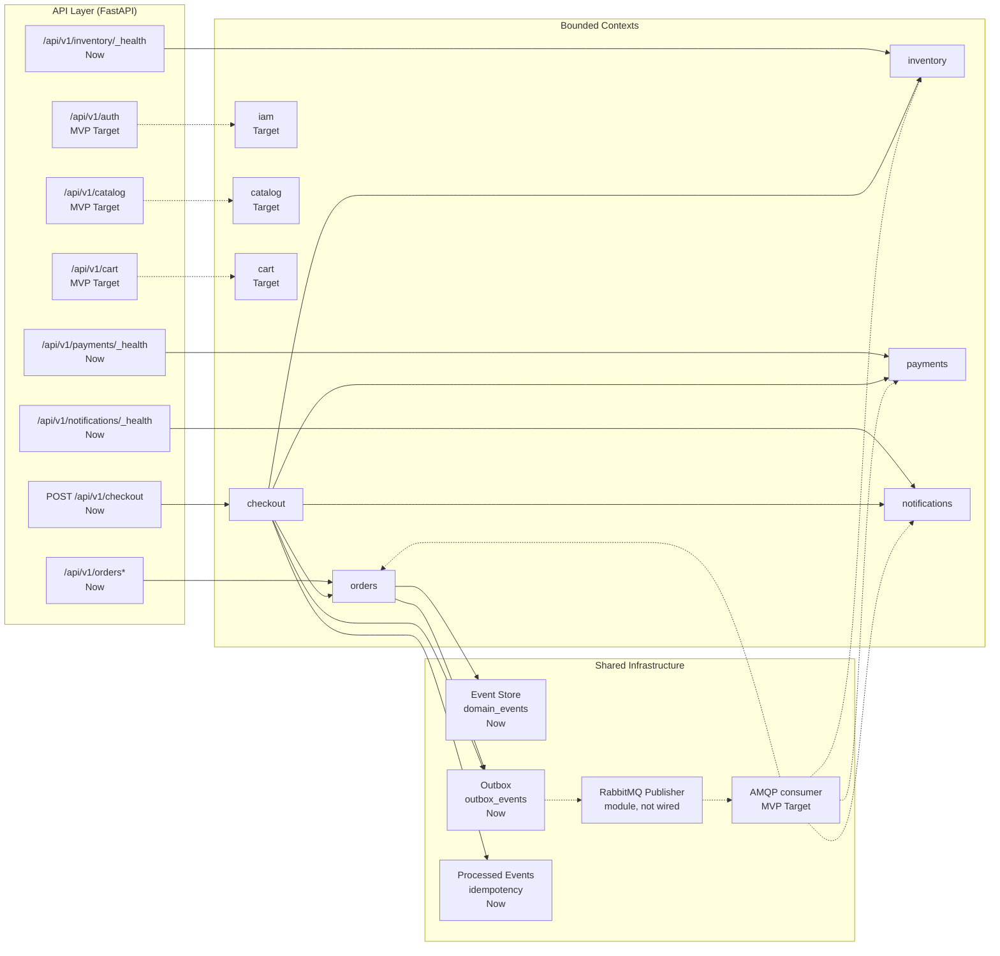
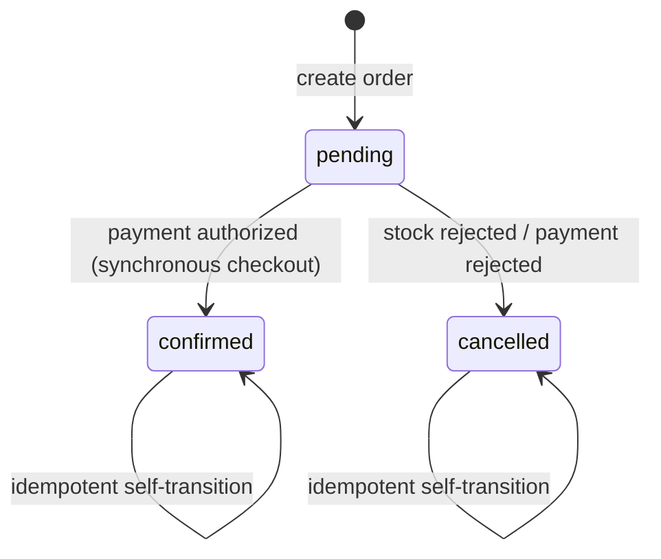

# Architecture

> **Canonical architecture notice**
> This document describes `eventcommerce` as it exists in the working tree today, plus the planned MVP target. Claims are tagged **Now** (committed and wired), **MVP Target** (next vertical slices), or **Future** (not committed). If a capability is partial — code exists but is not scheduled or connected — it is labeled **Partial** and never described as live.
>
> Product intent lives in [PRD.md](./PRD.md). Domain and event vocabulary is owned by [docs/GLOSSARY.md](./docs/GLOSSARY.md). Target UX lives in [DESIGN.md](./DESIGN.md). Significant decisions are recorded in the [ADR index](./docs/adr/README.md).

## Overview

EventCommerce is a **modular monolith**: one deployable Python backend composed of bounded contexts that each own their domain model, application services, infrastructure, and API surface. Today a synchronous `checkout` context coordinates order creation, inventory reservation, deterministic payment authorization, and order confirmation/cancellation in a single request. Shared data structures — an event envelope, a shared event store (`domain_events`), a transactional outbox (`outbox_events`), and an idempotency store (`processed_events`) — exist and are exercised by that synchronous path. Event choreography backed by an AMQP consumer and an outbox worker is the MVP Target; no broker is wired at runtime yet.

| Horizon | State |
|---|---|
| **Now** | Five bounded contexts exist in `backend/app/modules/`: `orders`, `inventory`, `payments`, `notifications`, and `checkout`. Orders exposes `POST /api/v1/orders`, `GET /api/v1/orders/{order_id}`, and `GET /api/v1/orders/{order_id}/timeline`; checkout exposes `POST /api/v1/checkout`. Shared event store, transactional outbox, idempotency store, and `dependency-injector` containers are implemented and wired. Inventory, payments, and notifications expose only `GET /api/v1/{module}/_health`. |
| **MVP Target** | Add `iam`, `catalog`, and `cart`; wire the existing RabbitMQ publisher and outbox worker into a runtime and add an AMQP consumer so contexts react to published events; reach the five-state order lifecycle; add confirm/cancel HTTP routes. |
| **Future** | Real payment provider, saga orchestration, dead-letter handling, observability stack, frontend. |

## Topology



Solid arrows are **Now**; dashed arrows are **MVP Target**. Checkout calls the order, inventory, payment, and notification contexts synchronously and persists to the shared outbox and idempotency store. The RabbitMQ publisher module exists but is not wired into the app runtime; nothing forwards outbox events to a broker and no AMQP consumer exists.

## Bounded contexts

### Current contexts (`backend/app/modules/`)

| Context | Responsibility | API state |
|---|---|---|
| `orders` | Order aggregate lifecycle. Current machine is `pending` → `confirmed`/`cancelled` (see [Order state machine](#order-state-machine)); the five-state lifecycle is MVP Target. | **Implemented** — `POST /api/v1/orders`, `GET /api/v1/orders/{order_id}`, `GET /api/v1/orders/{order_id}/timeline`. |
| `checkout` | Synchronous commerce orchestrator: order creation, inventory reservation, deterministic payment authorization, order confirmation/cancellation, outbox + idempotency writes. | **Implemented** — `POST /api/v1/checkout`. |
| `inventory` | Stock reservation and release with row-level locking (`FOR UPDATE`, deadlock-safe ordering). | **Partial** — use cases and locking are exercised via checkout; only `GET /api/v1/inventory/_health` exposed. |
| `payments` | Authorization and failure handling behind a deterministic simulated policy. | **Partial** — implemented and exercised via checkout; only `GET /api/v1/payments/_health` exposed. |
| `notifications` | Best-effort notification intent after checkout commits. | **Partial** — use case invoked by checkout; only `GET /api/v1/notifications/_health` exposed. |

### Target contexts (MVP)

| Context | Responsibility |
|---|---|
| `iam` | JWT registration, login, and role authorization as an owned bounded context. |
| `catalog` | Product browsing and catalog management. |
| `cart` | Purchase collection before checkout. |

Event names, producers, and consumers are governed by [docs/GLOSSARY.md](./docs/GLOSSARY.md). This document does not duplicate that table.

## Patterns

### Layer and boundary rules

Each context follows the same layering:

```text
domain/        — entities, value objects, domain services, domain errors
application/   — use cases, transaction/coordination logic, no framework imports
infrastructure/— SQLAlchemy models/repositories, messaging adapters
api/           — FastAPI routes, schemas, dependency-injector container
```

Rules:

- `domain/` has no dependencies on `application/`, `infrastructure/`, or `api/`.
- `application/` depends only on `domain/` and shared ports/protocols.
- `infrastructure/` implements `domain/` repository protocols and shared messaging abstractions.
- `api/` wires framework dependencies and delegates to `application/` use cases.

### Event-driven integration

| Pattern | State | Notes |
|---|---|---|
| **Shared event store** | **Now** | `backend/app/shared/events/` — `DomainEvent` base, `domain_events` table, `SqlAlchemyEventRepository`. Orders persists `OrderCreated` and reads timelines from it. |
| **Shared event envelope** | **Now** | `backend/app/shared/messaging/envelope.py` — `EventEnvelope` with an `event_type` literal. |
| **Transactional outbox** | **Now (emission)** | `backend/app/shared/messaging/outbox_repository.py` + `outbox_events` table. Checkout and orders persist `OrderCreated` / `OrderConfirmed` / `OrderCancelled`. Forwarding to a broker is not wired. |
| **RabbitMQ publisher** | **Partial** | `backend/app/shared/messaging/rabbitmq_publisher.py` exists (aio-pika) but is not connected or started by the app runtime. |
| **Outbox worker** | **Partial** | `backend/app/shared/messaging/outbox_worker.py` exists; no scheduler or lifespan integration. |
| **AMQP consumer** | **MVP Target** | No consumer module. |
| **Idempotent consumers** | **Now (primitives)** | `backend/app/shared/messaging/idempotency.py` — `ProcessedEventStore` claims and response cache used end-to-end by checkout. Wired AMQP consumers remain MVP Target. |
| **Choreography** | **MVP Target** | Contexts will react to published events without a central orchestrator once the outbox worker and AMQP consumer are wired. The current checkout is a deliberate synchronous commerce path. |

### Persistence topology

- **PostgreSQL** is the single persistence store.
- Each bounded context owns its tables (`orders`, `inventory`, `payments`, `notifications`).
- Shared tables `outbox_events`, `processed_events`, and `domain_events` live under `backend/app/shared/` and are **Now**.
- Migrations live in `backend/alembic/versions/` (six migrations covering the initial schema, shared domain events, checkout idempotency, and payments tables).

## Cross-cutting concerns

### Configuration

`backend/app/shared/config/settings.py` uses `pydantic-settings` to load environment variables from `.env` with the `EVENTCOMMERCE_` prefix and validation aliases for Postgres/RabbitMQ atomic variables. This is **Now**.

### Error handling

Each bounded context owns domain errors (`InvalidStateTransitionError`, `OrderNotFoundError`, `PaymentRejectedError`, etc.). Application use cases raise domain errors; API routes translate them to HTTP responses (e.g., `OrderNotFoundError` → 404, `IdempotencyConflictError` → 409, unexpected failures → 500 with a rollback). This is **Now** for orders and checkout; inventory and payments errors are raised and handled through the checkout path.

### Security and auth boundaries

There is no authentication or authorization code today; all endpoints (health, orders, and checkout) run without auth. IAM as an owned bounded context with JWT registration, login, and role enforcement is an **MVP Target**. Recorded in [0004-own-iam-context](./docs/adr/0004-own-iam-context.md).

### Observability

The backend uses standard Python logging only. Structured logs, correlation IDs, metrics, and distributed tracing are **Target** (post-MVP). See [Future roadmap](#future-roadmap) below.

### DI container strategy

`dependency-injector` per-module containers are **Now**: `OrdersContainer`, `InventoryContainer`, `PaymentsContainer`, `NotificationsContainer`, and `CheckoutContainer` exist under `backend/app/modules/*/api/container.py` and are wired in `backend/app/app.py`. Recorded in [0003-use-dependency-injector](./docs/adr/0003-use-dependency-injector.md).

### Request-scoped session management

Request-scoped session override via a `dependency-injector` container is **Now**. Routes override the module container's `session` provider with the request's `AsyncSession` and reset the override in a `finally` block, so each request shares one transaction across repositories and use cases.

### Consistency and idempotency

Idempotency primitives (`ProcessedEventStore`, the `processed_events` table, and the outbox pattern) are **Now** and are exercised end-to-end by checkout: claims with a transaction-scoped advisory lock, durable response cache, and `409` on payload mismatch. Wired consumers that react to published events are **MVP Target**. Domain terms are defined in [docs/GLOSSARY.md](./docs/GLOSSARY.md).

## Non-functional requirements

The table below tags every target as **Now**, **MVP Target**, or **Future**. Anything not implemented today is labeled honestly.

| Concern | Horizon | Target | How measured |
|---|---|---|---|
| Order state correctness | Now | 100% of simulated orders end in a valid terminal state with the expected event sequence | Domain tests assert the transitions in `backend/app/modules/orders/domain/services.py`. |
| Consumer idempotency | Now (checkout path) | Replaying an `Idempotency-Key` produces zero duplicate order, inventory, or payment records | Replay tests around `ProcessedEventStore` and the checkout use case; wired AMQP-consumer replay is MVP Target. |
| Payment simulation reproducibility | Now | Identical inputs produce the same authorization result across repeated runs | Deterministic policy tests in `backend/app/modules/payments/tests/test_payment_policy.py`. |
| End-to-end checkout latency | MVP Target | p95 < 500 ms on the deterministic local path | pytest benchmark around the checkout use case; benchmark evidence is not yet produced. |
| API health latency | Now | p95 < 100 ms for `GET /health` and module `_health` endpoints | httpx timing against local server. |
| Domain + application test coverage | Now | ≥ 80% of domain and application use-case lines covered | `pytest --cov` over `backend/app/modules/*/domain/` and `application/`. |
| Local reproducibility | Now | `pytest` passes locally without external secrets or paid services | CI / local run. |
| Auth boundary enforcement | MVP Target | All cart, checkout, and operator endpoints reject unauthenticated or unauthorized requests | Integration tests with JWT. |
| Structured observability | Future | Request correlation IDs and structured JSON logs in local and CI runs | Log output inspection. |
| Recovery and dead-letter handling | Future | Failed consumers retry with exponential backoff and land in a DLQ after exhaustion | Acceptance test with broker stopped. |

## Current Implementation Status

**Horizon vs Status semantics**: `Horizon` is the planning bucket — `Now` (committed today), `MVP Target` (planned for the MVP), or `Future` (intentionally not committed). `Status` is the implementation state of that decision: `implemented` (code exists and is wired), `partial` (code exists but is not connected or not complete), or `target` (not yet implemented). A `Future` row always carries `Status = target` because it is non-binding.

| Decision | Horizon | Status | Code evidence | Doc location |
|---|---|---|---|---|
| Bounded context scaffold: orders, inventory, payments, notifications, checkout | Now | implemented | `backend/app/modules/{orders,inventory,payments,notifications,checkout}/` | Bounded contexts |
| Orders HTTP API surface | Now | implemented | `backend/app/modules/orders/api/routes.py` — `POST /api/v1/orders`, `GET /api/v1/orders/{order_id}`, `GET /api/v1/orders/{order_id}/timeline` | API Layer |
| Checkout HTTP API surface | Now | implemented | `backend/app/modules/checkout/api/routes.py` — `POST /api/v1/checkout` | API Layer |
| Inventory / Payments / Notifications HTTP API surface | Now | partial | `backend/app/modules/{inventory,payments,notifications}/api/routes.py` expose only `GET /_health` | API Layer |
| Shared event store (`domain_events`) | Now | implemented | `backend/app/shared/events/` — `models.py`, `event_repository.py`, `repository.py`, `domain.py` | Patterns |
| Shared event envelope | Now | implemented | `backend/app/shared/messaging/envelope.py` | Patterns |
| Transactional outbox models + repository | Now | implemented | `backend/app/shared/messaging/outbox_repository.py`, `models.py` | Patterns |
| Outbox worker + scheduler | MVP Target | partial | `backend/app/shared/messaging/outbox_worker.py` exists; no scheduler or runtime wiring | Patterns |
| RabbitMQ publisher | MVP Target | partial | `backend/app/shared/messaging/rabbitmq_publisher.py` exists; not wired or connected | Patterns |
| AMQP consumer / event choreography | MVP Target | target | No consumer code | Patterns |
| Idempotent consumer store (`ProcessedEventStore`) | Now | implemented | `backend/app/shared/messaging/idempotency.py` | Cross-cutting concerns |
| `processed_events` table + durable response cache | Now | implemented | `backend/app/shared/messaging/models.py` | Cross-cutting concerns |
| `pydantic-settings` configuration | Now | implemented | `backend/app/shared/config/settings.py` | Cross-cutting concerns |
| `dependency-injector` DI containers | Now | implemented | `backend/app/modules/*/api/container.py`, wired in `backend/app/app.py` | Cross-cutting concerns |
| Request-scoped session override | Now | implemented | Routes override the module container `session` provider and reset it in `finally` | Cross-cutting concerns |
| Deterministic simulated payment provider | Now | implemented | `backend/app/modules/payments/domain/policy.py` (ADR 0005) | Patterns |
| Five-state order lifecycle | MVP Target | partial | Current machine is `pending` → `confirmed`/`cancelled`; `inventory_reserved` / `payment_authorized` intermediate states are not reachable | Order state machine |
| Confirm/cancel HTTP routes | MVP Target | partial | Use cases `confirm_order.py` / `cancel_order.py` exist; no HTTP routes | API Layer |
| IAM bounded context (JWT, roles) | MVP Target | target | No code | Bounded contexts |
| Catalog bounded context | MVP Target | target | No code | Bounded contexts |
| Cart bounded context | MVP Target | target | No code | Bounded contexts |
| Frontend storefront | Future | target | `frontend/` is not created | Future |

### Commerce event flow

The diagram below shows the delivered synchronous checkout path and what remains target. It deliberately does not draw the AMQP consumer or outbox forwarding as live.

```mermaid
sequenceDiagram
    actor S as Shopper/API
    participant CHK as checkout (Now)
    participant O as orders (Now)
    participant I as inventory (Now)
    participant P as payments (Now)
    participant N as notifications (Now)
    participant DE as domain_events (Now)
    participant OB as outbox_events (Now, not forwarded)
    participant RP as RabbitMQPublisher (module, not wired)

    S->>CHK: POST /api/v1/checkout
    CHK->>O: create order (pending)
    O-->>DE: record OrderCreated
    O-->>OB: persist OrderCreated (pending)
    CHK->>I: lock_and_check_availability + reserve
    alt payment approved (deterministic policy)
        CHK->>P: authorize payment
        CHK->>O: confirm order (confirmed)
        CHK-->>OB: persist OrderConfirmed (pending)
    else stock rejected or payment rejected
        CHK->>O: cancel order (cancelled)
        CHK->>I: release inventory on payment failure
        CHK-->>OB: persist OrderCancelled (pending)
    end
    CHK->>N: best-effort notification
    Note over OB: No outbox worker/scheduler or AMQP consumer is wired; nothing forwards these events to a broker.
    OB-.->RP: Target: polled + published when the worker is wired
```

### Order state machine

The transition set below matches `can_transition` in `backend/app/modules/orders/domain/services.py` exactly, including idempotent self-transitions. See [docs/GLOSSARY.md](./docs/GLOSSARY.md) for state vocabulary.



The full five-state lifecycle (`inventory_reserved`, `payment_authorized` as reachable intermediate states) is **MVP Target** and is not reachable in the current machine.

## Architecture Decision Records

Significant decisions are recorded in `docs/adr/`. Status rules and the full index live in [docs/adr/README.md](./docs/adr/README.md). Current status:

| # | Slug | Status |
|---|---|---|
| 0001 | [use-shared-event-store](./docs/adr/0001-use-shared-event-store.md) | Accepted (current implementation) |
| 0002 | [use-choreography](./docs/adr/0002-use-choreography.md) | Partially implemented — messaging primitives live; consumer wiring is MVP Target |
| 0003 | [use-dependency-injector](./docs/adr/0003-use-dependency-injector.md) | Accepted (current implementation) |
| 0004 | [own-iam-context](./docs/adr/0004-own-iam-context.md) | Accepted (MVP Target) |
| 0005 | [use-deterministic-simulated-payments](./docs/adr/0005-use-deterministic-simulated-payments.md) | Accepted (current implementation) |

## Future roadmap

Longer-term capabilities that are intentionally not committed in the MVP:

- Real payment provider adapter.
- Saga orchestration and dead-letter handling.
- Observability stack, runbooks, and a frontend storefront.

## Design link

Target UX flows, screen inventory, tokens, and states live in [DESIGN.md](./DESIGN.md). That document is the authoritative source for how a shopper or store operator interacts with the system.
