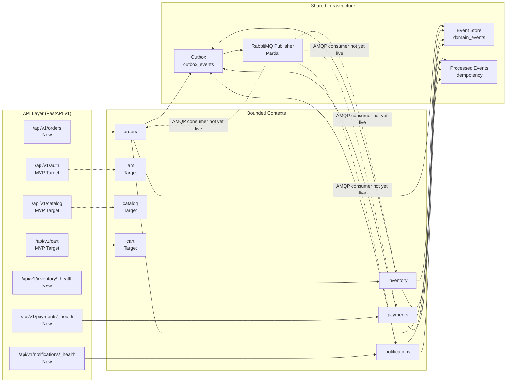
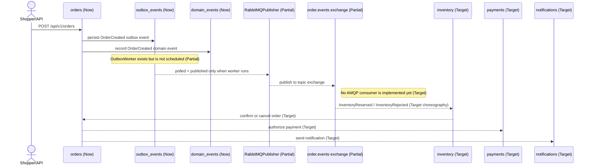
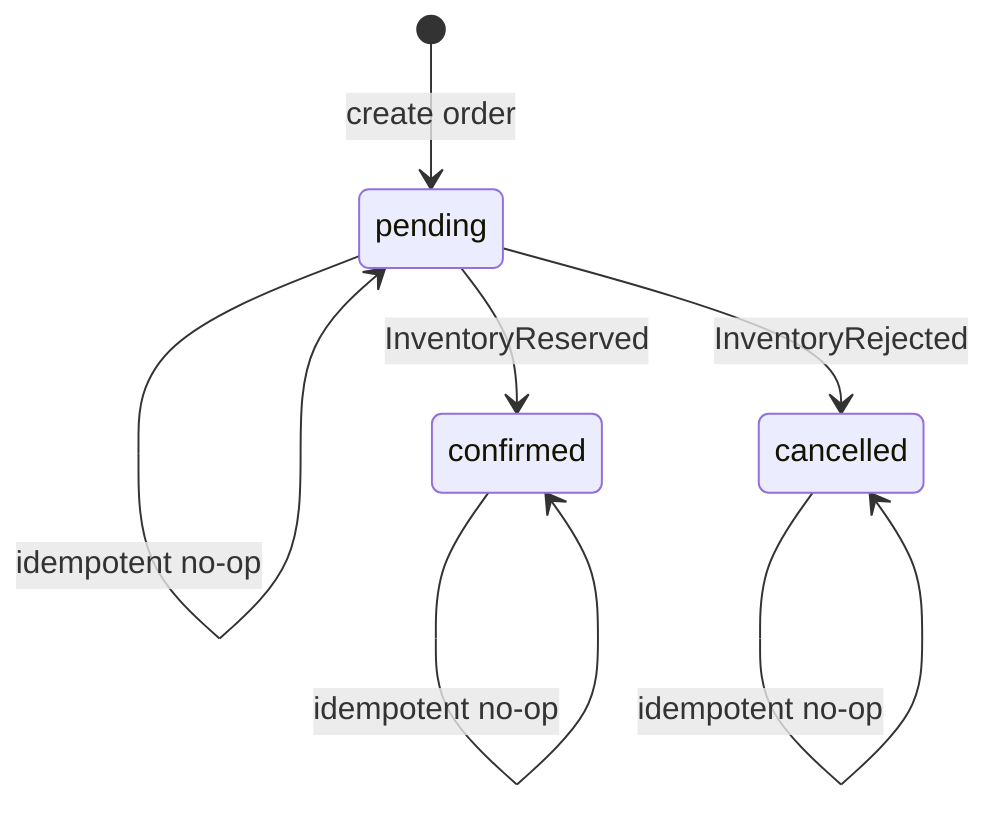

# Architecture

> **Canonical architecture notice**
> This document describes `eventcommerce` as it exists in the working tree today, plus the planned MVP target. Claims are tagged **Now** (committed and wired), **MVP Target** (next vertical slices), or **Future** (not committed). If a capability is partial — code exists but is not scheduled or connected — it is labeled **Partial** and never described as live.
>
> Product intent lives in [PRD.md](./PRD.md). Domain and event vocabulary is owned by [docs/GLOSSARY.md](./docs/GLOSSARY.md). Target UX lives in [DESIGN.md](./DESIGN.md). Significant decisions are recorded in the [ADR index](./docs/adr/README.md).

## Overview

EventCommerce is a **modular monolith**: one deployable Python backend composed of bounded contexts that each own their domain model, application services, infrastructure, and API surface. The boundaries are directory-based today; contexts communicate through a shared event envelope and a transactional outbox, not through direct service-to-service calls.

| Horizon | State |
|---|---|
| **Now** | Four bounded contexts exist in `backend/app/modules/`: `orders`, `inventory`, `payments`, `notifications`. Only `orders` exposes real HTTP routes. Shared infrastructure (`event store`, `outbox`, `idempotency`, `RabbitMQ publisher`) exists in `backend/app/shared/`. |
| **MVP Target** | Add `iam`, `catalog`, `cart`, and a `checkout` orchestrator; bootstrap the AMQP consumer and outbox worker; replace the random payment stub with a deterministic simulated provider. |
| **Future** | Real payment provider, saga orchestration, dead-letter handling, observability stack, frontend. |

## Topology



Solid arrows are **Now**; dashed arrows are **MVP Target** or **Partial**. The AMQP publisher exists but is not connected to the FastAPI lifespan, and no consumer subscribes to the `order.events` exchange.

## Bounded contexts

### Current contexts (`backend/app/modules/`)

| Context | Responsibility | API state |
|---|---|---|
| `orders` | Order aggregate lifecycle, state machine, timeline. | **Now** — `POST /api/v1/orders`, `GET /api/v1/orders/{order_id}`, `GET /api/v1/orders/{order_id}/timeline`. |
| `inventory` | Stock reservation and release. | **Partial** — use cases exist; only `GET /_health` exposed. |
| `payments` | Authorization and failure handling. | **Partial** — use cases exist; only `GET /_health` exposed. |
| `notifications` | Reactions to order events. | **Partial** — use cases exist; only `GET /_health` exposed. |

### Target contexts (MVP)

| Context | Responsibility |
|---|---|
| `iam` | JWT registration, login, and role authorization as an owned bounded context. |
| `catalog` | Product browsing and catalog management. |
| `cart` | Purchase collection before checkout. |
| `checkout` | Orchestrates cart, inventory, and payment in one request. |

Event names, producers, and consumers are governed by [docs/GLOSSARY.md](./docs/GLOSSARY.md). This document does not duplicate that table.

## Patterns

### Layer and boundary rules

Each context follows the same layering:

```text
domain/        — entities, value objects, domain services, domain errors
application/   — use cases, transaction/coordination logic, no framework imports
infrastructure/— SQLAlchemy models/repositories, messaging adapters
api/           — FastAPI routes, schemas, dependency-injector container
```

Rules:

- `domain/` has no dependencies on `application/`, `infrastructure/`, or `api/`.
- `application/` depends only on `domain/` and shared ports/protocols.
- `infrastructure/` implements `domain/` repository protocols and shared messaging abstractions.
- `api/` wires framework dependencies and delegates to `application/` use cases.

### Event-driven integration

| Pattern | State | Notes |
|---|---|---|
| **Shared event store** | **Now** | `backend/app/shared/events/` persists domain events in `domain_events` with neutral `aggregate_id`. |
| **Shared event envelope** | **Now** | `backend/app/shared/messaging/envelope.py` defines the canonical envelope. Event types are governed by the Glossary. |
| **Transactional outbox** | **Partial** | `OutboxEventModel` + `SqlAlchemyOutboxRepository` + `OutboxWorker` exist; no scheduler invokes `run_once()`. |
| **RabbitMQ publisher** | **Partial** | `RabbitMQPublisher` exists and targets the `order.events` topic exchange; not connected to the FastAPI lifespan. |
| **AMQP consumer** | **Target** | No consumer dispatches `OrderCreated` → inventory reservation, or `InventoryReserved/Rejected` → order confirmation/cancellation. |
| **Idempotent consumers** | **Partial** | `ProcessedEventStore` exists and is used by use cases; wired consumers are not live. |
| **Choreography** | **MVP Target** | Contexts will react to published events without a central orchestrator. |

### Persistence topology

- **PostgreSQL** is the single persistence store.
- Each bounded context owns its tables (`orders`, `inventory`, `payments`, `notifications`, `outbox_events`, `processed_events`, `domain_events`).
- `domain_events` and `outbox_events` are shared tables accessed through the shared infrastructure layer.
- Migrations live in `backend/alembic/versions/`.

## Cross-cutting concerns

### Configuration

`backend/app/shared/config/settings.py` uses `pydantic-settings` to load environment variables from `.env` with the `EVENTCOMMERCE_` prefix and validation aliases for Postgres/RabbitMQ atomic variables. This is **Now**.

### Error handling

Each bounded context owns domain errors (`InvalidStateTransitionError`, `OrderNotFoundError`, `PaymentRejectedError`, etc.). Application use cases raise domain errors; API routes translate them to HTTP responses (e.g., `OrderNotFoundError` → 404). This is **Now** for orders; **MVP Target** for the remaining contexts.

### Security and auth boundaries

There is no authentication or authorization code today. Public health endpoints and the orders CRUD surface run without auth. IAM as an owned bounded context with JWT registration, login, and role enforcement is an **MVP Target**. Planned ADR: [0004-own-iam-context](./docs/adr/0004-own-iam-context.md).

### Observability

The backend uses standard Python logging only. Structured logs, correlation IDs, metrics, and distributed tracing are **Target** (post-MVP). See [Future roadmap](#future-roadmap) below.

### DI container strategy

`dependency-injector` provides per-module containers. `OrdersContainer` wires repositories and use cases; `InventoryContainer`, `PaymentsContainer`, and `NotificationsContainer` are empty placeholders. This is **Partial** — the pattern is proven in orders but not replicated. Planned ADR: [0003-use-dependency-injector](./docs/adr/0003-use-dependency-injector.md).

### Request-scoped session management

`backend/app/modules/orders/api/routes.py` overrides the container's `session` dependency per request via `_orders_db_session`, then resets the override in a `finally` block. This keeps the unit of work request-scoped and is **Now**.

### Consistency and idempotency

`ProcessedEventStore` (`backend/app/shared/messaging/idempotency.py`) guards against duplicate event handling using the `processed_events` table with a `(event_id, consumer_name)` unique constraint. The outbox pattern atomically persists business state and pending events. These primitives are **Now**; wired consumers that exercise them end-to-end are **MVP Target**. Domain terms are defined in [docs/GLOSSARY.md](./docs/GLOSSARY.md).

## Non-functional requirements

The table below tags every target as **Now**, **MVP Target**, or **Future**. Anything not implemented today is labeled honestly.

| Concern | Horizon | Target | How measured |
|---|---|---|---|
| Order state correctness | Now | 100% of simulated orders end in a valid terminal state with the expected event sequence | Domain tests assert `pending → confirmed` / `pending → cancelled` only. |
| Consumer idempotency | MVP Target | Replaying the same event batch produces zero duplicate inventory, payment, or notification records | Replay test counts rows before/after. |
| Payment simulation reproducibility | MVP Target | Identical inputs produce the same authorization result across 100 repeated runs | Fixed-seed / deterministic policy test. |
| End-to-end checkout latency | MVP Target | p95 < 500 ms on the deterministic local path | pytest benchmark around checkout use case. |
| API health latency | Now | p95 < 100 ms for `GET /health` and module `_health` endpoints | httpx timing against local server. |
| Domain + application test coverage | Now | ≥ 80% of domain and application use-case lines covered | `pytest --cov` over `backend/app/modules/*/domain/` and `application/`. |
| Local reproducibility | Now | `pytest` passes locally without external secrets or paid services | CI / local run. |
| Auth boundary enforcement | MVP Target | All cart, checkout, and operator endpoints reject unauthenticated or unauthorized requests | Integration tests with JWT. |
| Structured observability | Future | Request correlation IDs and structured JSON logs in local and CI runs | Log output inspection. |
| Recovery and dead-letter handling | Future | Failed consumers retry with exponential backoff and land in a DLQ after exhaustion | Acceptance test with broker stopped. |

## Current Implementation Status

**Horizon vs Status semantics**: `Horizon` is the planning bucket — `Now` (committed today), `MVP Target` (planned for the MVP), or `Future` (intentionally not committed). `Status` is the implementation state of that decision: `implemented` (code exists and is wired), `partial` (code exists but is not connected or not complete), or `target` (not yet implemented). A `Future` row always carries `Status = target` because it is non-binding.

| Decision | Horizon | Status | Code evidence | Doc location |
|---|---|---|---|---|
| Bounded context scaffold: orders, inventory, payments, notifications | Now | implemented | `backend/app/modules/orders/`, `backend/app/modules/inventory/`, `backend/app/modules/payments/`, `backend/app/modules/notifications/` | Bounded contexts |
| Orders HTTP API surface (create, get, timeline) | Now | implemented | `backend/app/modules/orders/api/routes.py` | API Layer |
| Inventory / Payments / Notifications API surface | Now | partial | `backend/app/modules/inventory/api/routes.py`, `backend/app/modules/payments/api/routes.py`, `backend/app/modules/notifications/api/routes.py` expose only `GET /_health` | API Layer |
| Shared event store (`domain_events`) | Now | implemented | `backend/app/shared/events/event_repository.py`, `backend/app/shared/events/models.py` | Patterns |
| Shared event envelope | Now | implemented | `backend/app/shared/messaging/envelope.py` | Patterns |
| Transactional outbox models + repository | Now | implemented | `backend/app/shared/messaging/outbox_repository.py`, `backend/app/shared/messaging/models.py` | Patterns |
| Outbox worker + scheduler | Now | partial | `backend/app/shared/messaging/outbox_worker.py` exists; no scheduler invokes `run_once()` | Patterns |
| RabbitMQ publisher | Now | partial | `backend/app/shared/messaging/rabbitmq_publisher.py` exists; not wired into `backend/app/app.py` lifespan | Patterns |
| AMQP consumer / event choreography | MVP Target | target | No consumer code yet | Patterns |
| Idempotent consumer store (`ProcessedEventStore`) | Now | partial | `backend/app/shared/messaging/idempotency.py` is used by use cases; wired consumers are not live | Cross-cutting concerns |
| `processed_events` unique constraint | Now | implemented | `backend/app/shared/messaging/models.py` (`uq_processed_event`) | Cross-cutting concerns |
| `pydantic-settings` configuration | Now | implemented | `backend/app/shared/config/settings.py` | Cross-cutting concerns |
| `dependency-injector` DI containers | Now | partial | `backend/app/modules/orders/api/container.py` is wired; inventory/payments/notifications containers are empty | Cross-cutting concerns |
| Request-scoped session override | Now | implemented | `backend/app/modules/orders/api/routes.py` (`_orders_db_session`) | Cross-cutting concerns |
| IAM bounded context (JWT, roles) | MVP Target | target | No code | Bounded contexts |
| Catalog bounded context | MVP Target | target | No code | Bounded contexts |
| Cart bounded context | MVP Target | target | No code | Bounded contexts |
| Checkout orchestrator | MVP Target | target | No code | Bounded contexts |
| Deterministic simulated payment provider | MVP Target | target | `backend/app/modules/payments/application/authorize_payment.py` still uses a random stub | Patterns |
| Frontend storefront | Future | target | `frontend/` is empty | Future |

### Commerce event flow

The diagram below shows what is implemented now, what exists as code but is not scheduled, and what is only a target. It deliberately does not draw the AMQP consumer as a live path.



### Order state machine

The transition set below matches `can_transition` in `backend/app/modules/orders/domain/services.py` exactly, including idempotent self-transitions. See [docs/GLOSSARY.md](./docs/GLOSSARY.md) for state vocabulary.



## Architecture Decision Records

Significant decisions are recorded in `docs/adr/`. The following ADRs are planned and will be authored in the W5 slice:

| # | Slug | Decision |
|---|---|---|
| 0001 | [use-shared-event-store](./docs/adr/0001-use-shared-event-store.md) | Use a single shared event store instead of per-module event tables. |
| 0002 | [use-choreography](./docs/adr/0002-use-choreography.md) | Use event choreography rather than a central saga orchestrator for the MVP. |
| 0003 | [use-dependency-injector](./docs/adr/0003-use-dependency-injector.md) | Use `dependency-injector` for per-module containers and request-scoped session override. |
| 0004 | [own-iam-context](./docs/adr/0004-own-iam-context.md) | Make IAM an owned bounded context with JWT registration/login/roles. |
| 0005 | [use-deterministic-simulated-payments](./docs/adr/0005-use-deterministic-simulated-payments.md) | Keep payments behind ports/adapters and use a deterministic simulated provider for the MVP. |

## Design link

Target UX flows, screen inventory, tokens, and states live in [DESIGN.md](./DESIGN.md). That document is the authoritative source for how a shopper or store operator interacts with the system.
