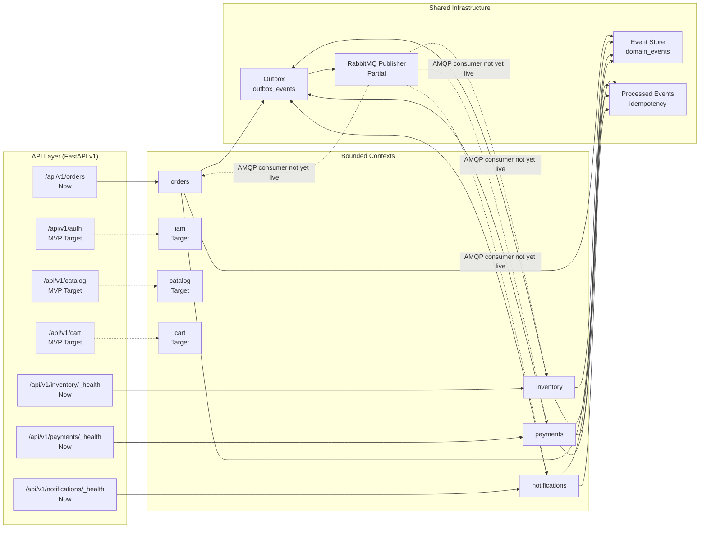

# Architecture

> **Canonical architecture notice**  
> This document describes `eventcommerce` as it exists in the working tree today, plus the planned MVP target. Claims are tagged **Now** (committed and wired), **MVP Target** (next vertical slices), or **Future** (not committed). If a capability is partial — code exists but is not scheduled or connected — it is labeled **Partial** and never described as live.
>
> Product intent lives in [PRD.md](./PRD.md). Domain and event vocabulary is owned by [docs/GLOSSARY.md](./docs/GLOSSARY.md). Target UX lives in [DESIGN.md](./DESIGN.md). Significant decisions are recorded in the [ADR index](./docs/adr/README.md).

## Overview

EventCommerce is a **modular monolith**: one deployable Python backend composed of bounded contexts that each own their domain model, application services, infrastructure, and API surface. The boundaries are directory-based today; contexts communicate through a shared event envelope and a transactional outbox, not through direct service-to-service calls.

| Horizon | State |
|---|---|
| **Now** | Four bounded contexts exist in `backend/app/modules/`: `orders`, `inventory`, `payments`, `notifications`. Only `orders` exposes real HTTP routes. Shared infrastructure (`event store`, `outbox`, `idempotency`, `RabbitMQ publisher`) exists in `backend/app/shared/`. |
| **MVP Target** | Add `iam`, `catalog`, `cart`, and a `checkout` orchestrator; bootstrap the AMQP consumer and outbox worker; replace the random payment stub with a deterministic simulated provider. |
| **Future** | Real payment provider, saga orchestration, dead-letter handling, observability stack, frontend. |

## Topology



Solid arrows are **Now**; dashed arrows are **MVP Target** or **Partial**. The AMQP publisher exists but is not connected to the FastAPI lifespan, and no consumer subscribes to the `order.events` exchange.

## Bounded contexts

### Current contexts (`backend/app/modules/`)

| Context | Responsibility | API state |
|---|---|---|
| `orders` | Order aggregate lifecycle, state machine, timeline. | **Now** — `POST /api/v1/orders`, `GET /api/v1/orders/{order_id}`, `GET /api/v1/orders/{order_id}/timeline`. |
| `inventory` | Stock reservation and release. | **Partial** — use cases exist; only `GET /_health` exposed. |
| `payments` | Authorization and failure handling. | **Partial** — use cases exist; only `GET /_health` exposed. |
| `notifications` | Reactions to order events. | **Partial** — use cases exist; only `GET /_health` exposed. |

### Target contexts (MVP)

| Context | Responsibility |
|---|---|
| `iam` | JWT registration, login, and role authorization as an owned bounded context. |
| `catalog` | Product browsing and catalog management. |
| `cart` | Purchase collection before checkout. |
| `checkout` | Orchestrates cart, inventory, and payment in one request. |

Event names, producers, and consumers are governed by [docs/GLOSSARY.md](./docs/GLOSSARY.md). This document does not duplicate that table.

## Patterns

### Layer and boundary rules

Each context follows the same layering:

```text
domain/        — entities, value objects, domain services, domain errors
application/   — use cases, transaction/coordination logic, no framework imports
infrastructure/— SQLAlchemy models/repositories, messaging adapters
api/           — FastAPI routes, schemas, dependency-injector container
```

Rules:

- `domain/` has no dependencies on `application/`, `infrastructure/`, or `api/`.
- `application/` depends only on `domain/` and shared ports/protocols.
- `infrastructure/` implements `domain/` repository protocols and shared messaging abstractions.
- `api/` wires framework dependencies and delegates to `application/` use cases.

### Event-driven integration

| Pattern | State | Notes |
|---|---|---|
| **Shared event store** | **Now** | `backend/app/shared/events/` persists domain events in `domain_events` with neutral `aggregate_id`. |
| **Shared event envelope** | **Now** | `backend/app/shared/messaging/envelope.py` defines the canonical envelope. Event types are governed by the Glossary. |
| **Transactional outbox** | **Partial** | `OutboxEventModel` + `SqlAlchemyOutboxRepository` + `OutboxWorker` exist; no scheduler invokes `run_once()`. |
| **RabbitMQ publisher** | **Partial** | `RabbitMQPublisher` exists and targets the `order.events` topic exchange; not connected to the FastAPI lifespan. |
| **AMQP consumer** | **Target** | No consumer dispatches `OrderCreated` → inventory reservation, or `InventoryReserved/Rejected` → order confirmation/cancellation. |
| **Idempotent consumers** | **Partial** | `ProcessedEventStore` exists and is used by use cases; wired consumers are not live. |
| **Choreography** | **MVP Target** | Contexts will react to published events without a central orchestrator. |

### Persistence topology

- **PostgreSQL** is the single persistence store.
- Each bounded context owns its tables (`orders`, `inventory`, `payments`, `notifications`, `outbox_events`, `processed_events`, `domain_events`).
- `domain_events` and `outbox_events` are shared tables accessed through the shared infrastructure layer.
- Migrations live in `backend/alembic/versions/`.

## Cross-cutting concerns

> Placeholder for W4b expansion: configuration (`pydantic-settings`), error handling, logging/observability, DI container strategy, and request-scoped session management.

## Non-functional requirements

> Placeholder for W4b expansion: measurable NFRs for latency, idempotency, testability, and local reproducibility.

## Current Implementation Status

> Placeholder for W4b expansion: decision/status matrix with columns `Decision | Horizon | Status | Code evidence | Doc location`. Status values are `implemented`, `partial`, or `target`. Partial capabilities will not be described in present tense.

## Architecture Decision Records

Significant decisions are recorded in `docs/adr/`. The following ADRs are planned and will be authored in the W5 slice:

| # | Slug | Decision |
|---|---|---|
| 0001 | [use-shared-event-store](./docs/adr/0001-use-shared-event-store.md) | Use a single shared event store instead of per-module event tables. |
| 0002 | [use-choreography](./docs/adr/0002-use-choreography.md) | Use event choreography rather than a central saga orchestrator for the MVP. |
| 0003 | [use-dependency-injector](./docs/adr/0003-use-dependency-injector.md) | Use `dependency-injector` for per-module containers and request-scoped session override. |
| 0004 | [own-iam-context](./docs/adr/0004-own-iam-context.md) | Make IAM an owned bounded context with JWT registration/login/roles. |
| 0005 | [use-deterministic-simulated-payments](./docs/adr/0005-use-deterministic-simulated-payments.md) | Keep payments behind ports/adapters and use a deterministic simulated provider for the MVP. |

## Design link

Target UX flows, screen inventory, tokens, and states live in [DESIGN.md](./DESIGN.md). That document is the authoritative source for how a shopper or store operator interacts with the system.
