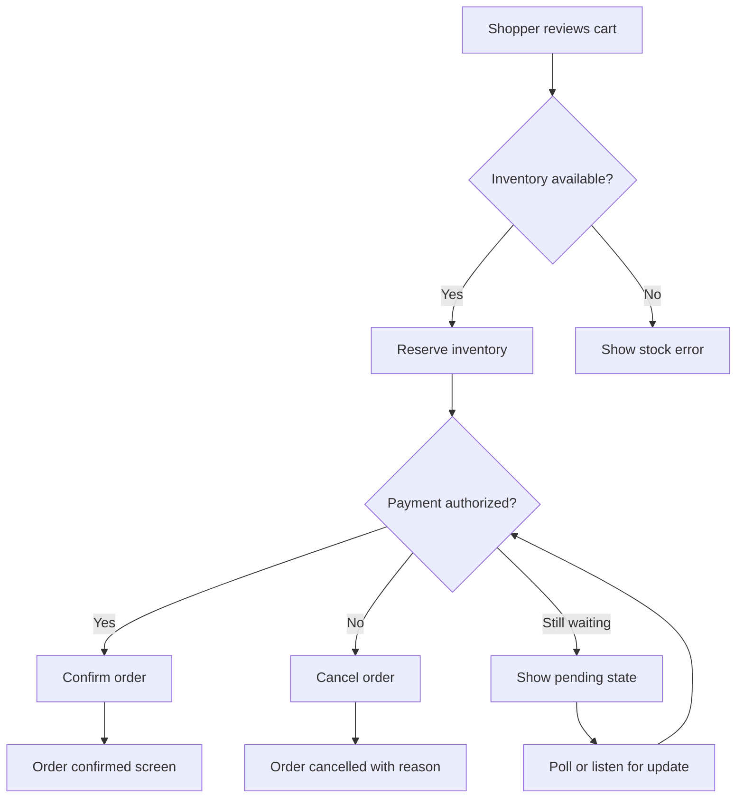

# Design

> **Target Design Notice**
> This document describes the intended user experience for the eventcommerce MVP. The project currently has no frontend implementation and the `frontend/` directory is reserved. Only the **Now** column in the flows and inventory below is binding today; the **MVP Target** column is the design north star for the next vertical slice. Product scope lives in [PRD.md](./PRD.md), system structure in [ARCHITECTURE.md](./ARCHITECTURE.md), domain vocabulary in [docs/GLOSSARY.md](./docs/GLOSSARY.md), and decisions in the [ADR index](./docs/adr/README.md).

## Overview

The design is built around two ideas: **trustworthy commerce** and **event-status transparency. Shoppers must always know what happened, what is happening, and what will happen next. Store operators must see the same truth across inventory and orders. The UI favors clear hierarchy, calm feedback, and honest labels over decorative surfaces.

This document owns the target screen map, user flows, visual tokens, component states, and accessibility rules. It does not duplicate backend architecture, event choreography, bounded context boundaries, or ADR rationale; those live in [ARCHITECTURE.md](./ARCHITECTURE.md) and the [ADR index](./docs/adr/README.md).

## Flows

### Shopper browse-to-track journey

| Step | Now | MVP Target |
|---|---|---|
| Browse catalog | API-only; no UI | Catalog page with filters, search, and stock signal |
| Add to cart | API-only; no UI | Cart drawer/page with line items, quantities, and subtotal |
| Review checkout | API-only; no UI | Checkout summary with shipping, payment stub, and place-order CTA |
| Place order | `POST /api/v1/orders` | Same endpoint, surfaced through checkout form |
| View order status | `GET /api/v1/orders/{id}` | Order tracking page with live status and timeline |
| Receive result | Raw JSON response | In-context success, failure, or pending message |

### Store operator inventory-and-order journey

| Step | Now | MVP Target |
|---|---|---|
| Review catalog | API-only; no UI | Operator catalog list with edit and stock-adjust actions |
| Adjust stock | API-only; no UI | Inline stock editor with confirmation and event log |
| List orders | API-only; no UI | Order queue with filters by status and date |
| Confirm or cancel | API-only; no UI | Operator action triggers the existing domain transitions |
| Inspect payment decision | Read logs/tests | Payment simulation panel showing deterministic result for inputs |

### Checkout success / failure / pending flow

## Screen inventory

| Route / screen | Purpose | Persona | Horizon | Empty | Loading | Error | Success |
|---|---|---|---|---|---|---|---|
| Catalog | Browse products, see availability | Shopper | MVP Target | No products yet | Skeleton grid | Retry if fetch fails | Results rendered |
| Cart | Review selected items before checkout | Shopper | MVP Target | Cart is empty | Spinner overlay | Item unavailable | Ready for checkout |
| Checkout | Confirm shipping and payment stub | Shopper | MVP Target | — | Placing order… | Payment / stock failure | Order placed |
| Order tracking | Follow order status and timeline | Shopper | MVP Target | Order not found | Loading timeline | Fetch error | Status + events shown |
| Operator catalog | Manage products and stock | Store Operator | MVP Target | No catalog entries | Skeleton list | Save failed | Changes saved |
| Operator orders | Review and act on order queue | Store Operator | MVP Target | No orders | Loading queue | Fetch error | Queue rendered |
| Login / Register | Authenticate before protected flows | Shopper / Operator | MVP Target | — | Authenticating… | Invalid credentials | Logged in |

## Colors

Color intent follows semantic roles, not marketing names.

- **Brand primary** is reserved for the main action and focus ring; it must maintain at least 4.5:1 contrast against white for text.
- **Success / warning / danger / info** carry both a base and a subtle background so status surfaces can be accessible without relying on hue alone.
- **Surface** layers separate content from background: `surface` for cards, `surface-muted` for strips and secondary areas, `surface-inverse` for footer or high-contrast moments.
- **Text** uses three weights: primary for body, secondary for captions, tertiary for metadata.

## Typography

The type scale is designed for scanning.

- **Display** is used once per page for the screen title.
- **Heading lg/md/sm** structure sub-sections without skipping levels.
- **Body** is the workhorse for descriptions, labels, and form copy.
- **Label** is uppercase-styled for buttons, badges, and micro-copy.
- **Code** is used for order IDs, event names, and technical metadata.

## Layout

### Spacing and grid

- Use a 4 px base grid. All spacing tokens are multiples of 4 px.
- Page gutters start at `spacing.4` on mobile and grow to `spacing.6` at `md` and `spacing.8` at `lg`.
- Content max-width is `1280px` centered; reading widths stay under `75ch` for prose.
- Cards and forms use `rounded.lg` and `shadow.md` on elevated surfaces.

### Responsive strategy

- **Mobile first**: every screen works at `320px` width without horizontal scroll.
- **Breakpoints** are `sm: 640px`, `md: 768px`, `lg: 1024px`, `xl: 1280px`.
- Catalog grids go from 1 column on mobile to 2 on `sm`, 3 on `md`, 4 on `lg`.
- Tables become horizontally scrollable containers below `md` rather than being reflowed into cards.
- Checkout forms stack fields on mobile and split into two columns at `lg`.

## States

Every interactive element and status surface defines at least these states:

| State | Visual rule | Interaction rule |
|---|---|---|
| Default | Rest tokens | Focusable, actionable |
| Hover | Slight elevation or background shift | Pointer cursor |
| Focus | `focus-ring` outline, 2 px offset | Visible even for mouse users |
| Active / pressed | Background darkens 8 % | Immediate feedback |
| Disabled | `text-tertiary` on `surface-muted`; no shadow | Not focusable, `aria-disabled="true"` |
| Loading | Spinner replaces or sits beside label | Suppress duplicate submission |
| Empty | Illustration + clear next step | Primary CTA to populate |
| Error | `danger` text + `danger-subtle` background | Recoverable action provided |
| Success | `success` text + `success-subtle` background | Auto-dismiss or explicit close |

### Async status language

Status copy is exact, not friendly-to-a-fault. Use the vocabulary defined in [docs/GLOSSARY.md](./docs/GLOSSARY.md):

- `pending` — order or action submitted, no final result yet.
- `reserved` — inventory held for the order.
- `rejected` — inventory or payment could not be satisfied.
- `confirmed` — order reached a successful terminal state.
- `cancelled` — order reached a terminal cancelled state.

Never describe an unwired consumer or partial backend flow as if it were live in the UI.

## Accessibility

- **WCAG target**: WCAG 2.2 Level AA for color contrast, focus visibility, and form error association.
- **Keyboard / focus**: every interactive element is reachable by Tab; focus order matches visual order; skip link provided on every page.
- **Semantic structure**: one `h1` per page, headings never skip levels, tables use `th`/`scope`, buttons are not links.
- **Live status**: regions with `aria-live="polite"` announce async status changes (`pending` → `confirmed`) without stealing focus.
- **Reduced motion**: honor `prefers-reduced-motion` by disabling entrance animations and limiting motion to opacity-only transitions.
- **Forms / errors**: every input has an associated `label`; errors are linked with `aria-describedby`; error text explains how to fix, not just what failed.
- **Color independence**: status is never communicated by color alone; icons and text accompany every semantic color.

## Components

Components are described by responsibility and states, not by framework-specific implementation. Concrete framework choices are deferred to the `add-frontend-mvp` follow-up.

- **Button**: primary, secondary, danger, ghost variants; loading state with `aria-busy`.
- **StatusBadge**: maps to `pending`, `reserved`, `confirmed`, `cancelled`, `rejected`; includes icon + text.
- **ProductCard**: image, name, price, availability signal, add-to-cart action; empty/loading/error/success states.
- **CartLine**: product snapshot, quantity stepper, remove action, subtotal.
- **CheckoutSummary**: cart lines, totals, payment stub selector, place-order CTA, validation errors.
- **OrderTimeline**: chronological event list using the canonical event vocabulary from [docs/GLOSSARY.md](./docs/GLOSSARY.md).
- **OperatorOrderRow**: order id, customer, total, status badge, confirm/cancel actions; disabled when action is in flight.
- **StockEditor**: current quantity, delta input, save action, event log preview.

## Do's and Don'ts

- **Do** label every status with the exact event-commerce vocabulary from [docs/GLOSSARY.md](./docs/GLOSSARY.md).
- **Do** show the same order status to the shopper and the operator; a single source of truth builds trust.
- **Do** reserve primary color for the main action on a screen; do not paint every CTA primary.
- **Do** provide an empty state with a clear next action instead of a blank area.
- **Don't** use present-tense claims for screens marked MVP Target or Future.
- **Don't** duplicate backend topology diagrams; link to [ARCHITECTURE.md](./ARCHITECTURE.md).
- **Don't** rely on color alone to communicate status; pair it with text and icons.
- **Don't** block the shopper on polling if the backend consumer is not yet live; surface the honest pending state instead.
